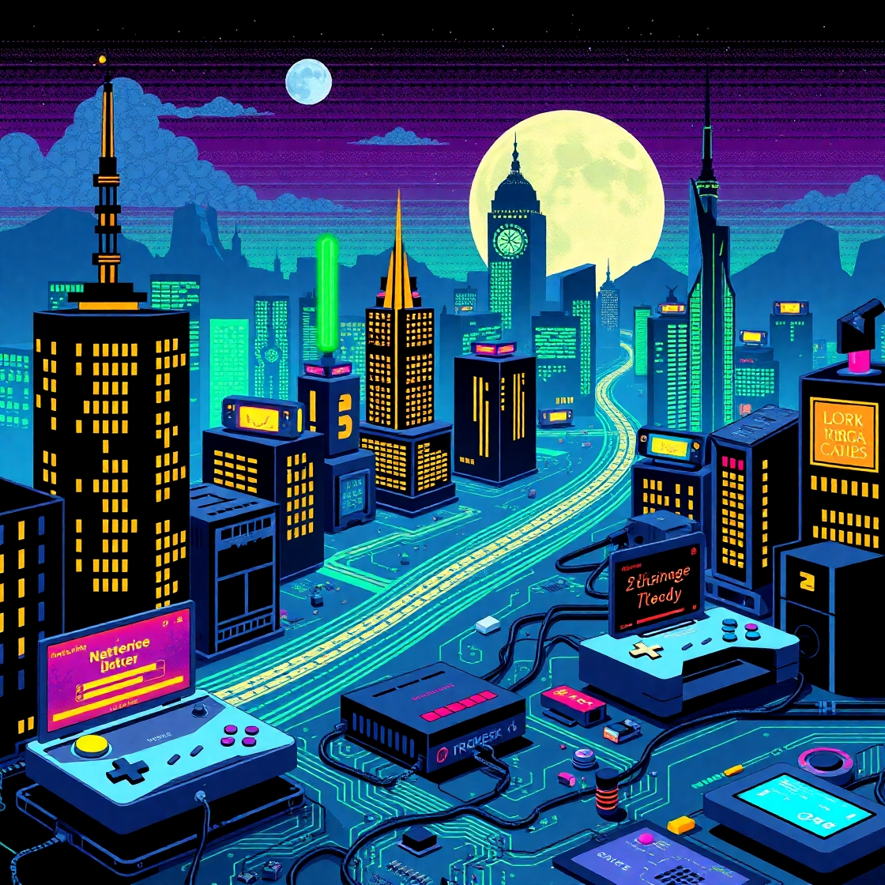

    Preview do podcast

    <audio src="output/Episódio_editado.MP3" controls title="Podcast editado"></audio>

# Projeto Podcast Gerado por I.A.s

Projeto com o objetivo de gerar um podcast utilizando ferramentas de IA através de prompts mais trabalhado.

## ✨ Prompts utilizados 

- ChatGPT:

    Você é um roteirista de podcast, e vamos criar um  roteiro de um podcast de tecnologia, focado em frontend cujo o nome "Os Guardiões da Rede"
    Decifrando as novas tecnologias do mercado e as conexões do futuro  e tem foco em redes de computadores, mikrotik e etc,  com o público alvo de iniciantes em 

    O formato do roteiro deve ser
    
   > [INTRODUÇÃO]
    
   > [CURIOSIDADE 1]
    
   > [CURIOSIDADE 2]

    > [FINALIZAÇÃO]

    {REGRAS}

    no bloco [INTRODUÇÃO] substitua por uma introdução iguais as introduções dos vídeos como se fossem escritos por youtubers ou tiktokers 

    no bloco [CURIOSIDADE 1] substitua por uma curiosidade da mikrotik 

    no bloco [CURIOSIDADE 2] sobre uma ferramenta para monitoramento de redes 

    no bloco [FINALIZAÇÃO] substitua por uma despedida cool  

    use termos de fácil explicação

    O podcast vai ser apresentado somente por uma pessoa, chamada Liz 

    O podcast deve ser curto

    {REGRAS NEGATIVAS}

    Não use muitos termos técnicos

    Não ultrapasse 5 minutos de duração

--

- Prompt MidJourney

Create a retro-style pixel art image featuring a digital cityscape with router icons and elements referencing gaming culture, like video game controllers and circuit boards. Include subtle nods to popular nerd franchises like Star Wars and Lord of the Rings, using visual motifs such as lightsabers and elvish runes. The overall style should be nostalgic and vintage, reminiscent of 8-bit or 16-bit video games, with a focus on networks and gaming, without neon lights and without any text in the image.

## 💻 Tecnologias utilizadas no projeto

- [ChatGPT](https://chat.openai.com/) 
- [MidJourney](https://www.midjourney.com/app/)
- [ElevenLabs](https://beta.elevenlabs.io/)
- [Capcut](https://www.capcut.com/pt-br/)

## ✨ Como foi feito ?

- Roteiro gerado via chatgpt
- Audio gerado pela elevenLabs
- Midjourney Para gerar capas
- Capcut para tratar aúdio e adicionar sons de fundo

